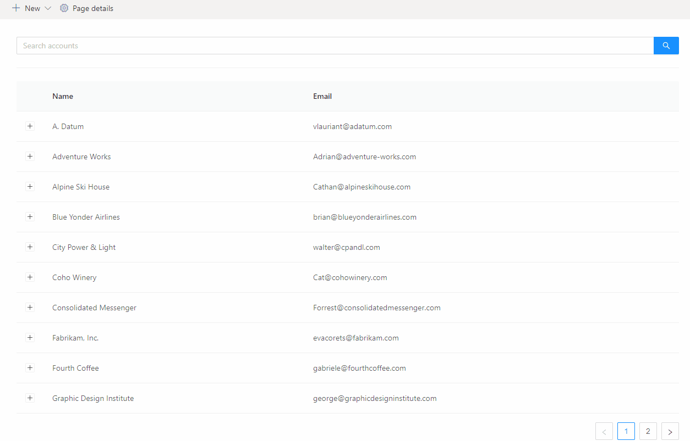

# React Dynamics CRM API

## Summary
This sample shows how to consume Dynamics CRM API using AadTokenProvider class.

## Used SharePoint Framework Version

## Applies to

* [SharePoint Framework Developer](http://dev.office.com/sharepoint/docs/spfx/sharepoint-framework-overview)
* [Office 365 developer tenant](http://dev.office.com/sharepoint/docs/spfx/set-up-your-developer-tenant)

## Solution

Solution|Author(s)
--------|---------
react-dynamics365-api|Ramin Ahmadi

## Version history

Version|Date|Comments
-------|----|--------
1.0.0|Jul 12, 2020|Initial release

## Disclaimer

**THIS CODE IS PROVIDED *AS IS* WITHOUT WARRANTY OF ANY KIND, EITHER EXPRESS OR IMPLIED, INCLUDING ANY IMPLIED WARRANTIES OF FITNESS FOR A PARTICULAR PURPOSE, MERCHANTABILITY, OR NON-INFRINGEMENT.**

---

## Features

This sample illustrates the following concepts on top of the SharePoint Framework:

* Using AadTokenProvider to consume Dynamics CRM API.
* How to get Accounts/Contacts information from Dynamics 365.
* React Hooks
* Using async / await for the async calls
* Ant design for the UI.

## Configuration

* Login to Azure Portal.
* Go to the App Registrations Page.
* Select SharePoint Online Client Extensibility.
* Select API Permissions.
* Add "Dynamics CRM" permission.
* Go to the manifest page, and makes sure the value for the allowPublicClient and the oauth2AllowImplicitFlow is set to true.

