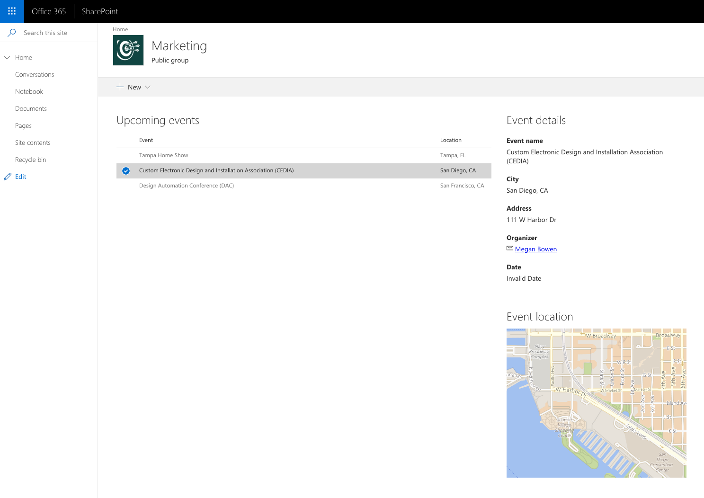

# Dynamic data

Sample web parts illustrating using the SharePoint Framework Dynamic data capability.

## Used SharePoint Framework Version 

## Applies to

* [SharePoint Framework](https://docs.microsoft.com/sharepoint/dev/spfx/sharepoint-framework-overview)
* [Office 365 developer tenant](https://docs.microsoft.com/sharepoint/dev/spfx/set-up-your-developer-tenant)

## Solution

Solution|Author(s)
--------|---------
react-events-dynamicdata|Waldek Mastykarz (MVP, Rencore, @waldekm)
react-events-dynamicdata|Hugo Bernier (MVP, [@bernierh](https://twitter.com/bernierh))

## Version history

Version|Date|Comments
-------|----|--------
1.2|July 8, 2020|Updated sample to SPFx v1.10.0 (Hugo Bernier)
1.1|November 9, 2018|Updated sample to SPFx v1.7.0
1.0|June 5, 2018|Initial release

## Disclaimer
**THIS CODE IS PROVIDED *AS IS* WITHOUT WARRANTY OF ANY KIND, EITHER EXPRESS OR IMPLIED, INCLUDING ANY IMPLIED WARRANTIES OF FITNESS FOR A PARTICULAR PURPOSE, MERCHANTABILITY, OR NON-INFRINGEMENT.**

---

## Minimal Path to Awesome

* clone this repo
* move to right folder
* in the command line run:
  * `npm install`
  * `gulp bundle --ship`
  * `gulp package-solution --ship`
* from the `sharepoint/solution` folder, deploy the `.sppkg` file to the App catalog in your tenant
* in the site where you want to test this solution
  * add the app named _react-events-dynamicdata-client-side-solution_
  * edit a page
  * add the three web parts named: _Events_, _Event details_ and _Map_
  * configure the _Event details_ web part:
    * as _Connect to source_, choose the _Events_ option
    * as _Event's properties_, choose the _Event_ option
  * configure the _Map_ web part:
    * get a Bing maps API key (follow the link in the web part)
    * as _Connect to source_, choose the _Events_ option
    * as _Event's properties_, choose the _Location_ option
    * as _Address_, choose the _address_ option
    * as _City_, choose the _city_ option

## Features

This sample contains a set of SharePoint Framework client-side web parts that illustrate the Dynamic data capability.

Web parts in this solution illustrate the following concepts on top of the SharePoint Framework:

* making web part a dynamic data source
* exposing multiple data properties from a single data source
* subscribing to dynamic data source notifications from a web part
* deploying list instances from a SharePoint Framework solution package
* using [PnPjs](https://github.com/pnp/pnpjs) to retrieve data from a SharePoint list
* using [SharePoint Framework React Controls](https://github.com/SharePoint/sp-dev-fx-controls-react) in web parts

